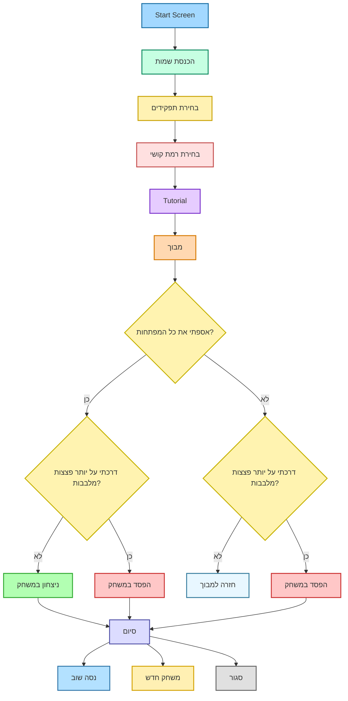

# 🎮 תכנון רמות – MazeMates 

## 1. תיאור כללי של המשחק
המשחק מיועד ל־**שני משתתפים**:
- **המטייל** – שולט בדמות בגוף ראשון בתוך מבוך.
- **הנווט** – רואה את כל המבוך במבט־על ומכוון את המטייל.

מטרת המשחק - לסיים את המבוך בהצלחה!

המשחק מיועד לילדים ובני נוער על הרצף האוטיסטי בתפקוד בינוני-גבוה, ומטרתו **לעודד תקשורת, שיתוף פעולה וחשיבה משותפת**.

לכל שחקן מסך משל עצמו + מקלדת ועכבר.

### ליבת המשחק
- **סיור במפה**
- **פתיחת דלתות**:
  - **ללא חידה**: המטייל עומד על הפד מול הדלת, הנווט לוחץ על כפתור ייעודי, הדלת נפתחת בהצלחה.
  - **עם חידה(חידת תמונה)**:
    - הנווט רואה תמונה מלאה (למשל: חווה).
    - המטייל רואה רק את הרקע + כל הפריטים בנפרד.
    - המטייל ממקם את החיות/פריטים לפי הנחיית הנווט.
    - כאשר המיקום נכון – הדלת נפתחת.
- **איסוף מפתחות**: חובה להשלמת המבוך.

### התקדמות במשחק
המשחק כולל:
- רמה קלה
- רמה בינונית
- רמה קשה  

והמטפל בוחר בה בהתחלה.

תפקידי נווט/מטייל נקבעים בתחילת המשחק.

בסיום המבוך – המשחק מסתיים בניצחון.

---

# 2. תכנון רמות (לפי דרישות המטלה)

## ⭐ רמת 0 – מדריך (Tutorial)

### מטרות
- ללמד את כל הפעולות, (תנועה, ניווט, פתיחת דלתות ופתרון חידת תמונה בסיסית) לכל שחקן מנקודת מבטו.
- מבוך קצר, ללא זמן וללא לחץ,

### מבנה המפה
- מבוך קטן בצורת “L”.
- דלת אחת רגילה + דלת אחת עם חידה.

### מכניקות
- **תנועה בסיסית** - המטייל מגיע לנקודה מסומנת לפי הנחיית הנווט.
- **פתיחת דלת** - עמידה על הפד + לחיצה של הנווט.
- **חידת תמונה פשוטה (2 פריטים)** – פרה + תרנגולת.
- **מפתח בודד** לניקוד בלבד.
- **דילוג** - אופציית דילוג לשחקנים מנוסים.

### סיום
כל המכניקות היסודיות נלמדות.

---

## ⭐ רמת קושי 1 – קלה

### מאפייני קושי
- מבוך קטן (17x17).
- 2 דלתות רגילות + דלת אחת עם חידה.
- חידת תמונה עם **3–4 פריטים**

.

### מבנה המפה
- שבילים רחבים, מעט פניות.
-2 מפתחות במיקומים גלויים וברורים.

### חידה לדוגמא
**“חיית המחמד בבית”**  
תמונה מלאה אצל הנווט הכוללת:  
- כלב  
- חתול  
- קערת אוכל  
- כרית  

המטייל מקבל רקע + כל פריט בנפרד וממקם לפי הנחיות המנווט.

### למה זה קל?
- מעט פריטים  
- מפת תנועה פשוטה  
- חידה בודדת  
- מרחב פתוח וברור  

---

## ⭐ רמת קושי 2 – בינונית

### מאפייני קושי
- מבוך בינוני (20×20).
- מבוך יותר מפותל.
- 3 דלתות רגילות + 2 דלתות עם חידות.
- חידות תמונה עם **5–7 פריטים**.

### מבנה המפה
- שבילים צדדיים ומסלולים שמבלבלים מעט.
- חלק מהמפתחות מוסתרים בזוויות.

### חידות לדוגמא
- **חידת “החווה”** – פרה, תרנגולת, עז, סוס, עגלה, דלי.
- **חידת “סידור החדר”** – צעצועים: כדור, דובי, מכונית, ספרים, קלמר.

### מפתחות
- 4–5 מפתחות, חלקם מוסתרים.

### למה זה בינוני?
- יותר פריטים בחידות  
- 2 חידות במקום 1  
- ניווט מורכב יותר  
- צורך בתקשורת מילולית ברורה  

---

## ⭐ רמת קושי 3 – קשה

### מאפייני קושי
- מבוך גדול (24×24).
- הרבה מסלולים מטעים.
- 4 דלתות רגילות + 3 דלתות עם חידות.
- חידות תמונה עם **8-9 פריטים**.

### מבנה המפה
- אזורים גדולים הדורשים התמצאות מהירה מצד הנווט.
- חדרי חידות ייעודיים.

### חידות לדוגמא
- **“העיר” – החידה הקשה ביותר**  
מכוניות, אוטובוס, רמזור, ספסל, עץ, הולך רגל עם כלב ועוד.
- **חדר הילדים** - צעצועים, ספרים, שולחן, מנורה, כריות, שטיח, מדף ועוד..
- **לונה פארק** 
   - גלגל ענק, צמר גפן מתוק, ליצן, רכבת הרים וכו'..

### מפתחות
- 6 מפתחות מוסתרים היטב.
- חלקם מאחורי פניות חדות.

### למה זה קשה?
- עומס מידע גבוה  
- חידות עם המון פריטים  
- תיאום טיימינג מורכב  
- מבוך מבלבל ומרובה מסלולים  

---

# 3. תרשים זרימה של מבנה המשחק

