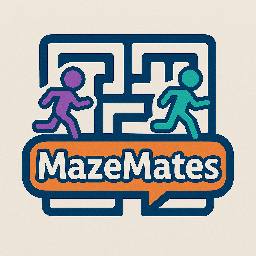

# 🌀 MazeMates
### אחד רואה, השני עושה – אבל מנצחים רק ביחד!  

---

## 🎮 על המשחק

הוא משחק מחשב שיתופי שנועד לפתח **תקשורת, שיתוף פעולה, וויסות וקבלת החלטות משותפת** בין בני נוער על הרצף האוטיסטי בתפקוד גבוה.  

המשחק מציב את המשתתפים במבוך, שבו כל אחד רואה **חלק אחר של העולם** ועליהם לעבוד יחד כדי למצוא את הדרך החוצה.  
אין דרך לנצח לבד — רק אם מתקשרים, מתאמים ומקשיבים זה לזה.  

החוויה מבוססת על תנועה, תיאום זמן־אמת, ופתרון בעיות קבוצתי דרך מחשב, עם שילוב של אלמנטים קוגניטיביים, חזותיים וחברתיים.

---

## 🧩 איך זה עובד?

- בתחילת המשחק בוחרים את התפקידים ורמת הקושי, 
- המשחק כולל **מבוך** ובתוכו חידות וחפצים לאיסוף.
- בנוסף, המבוך כולל מכשולים כמו **פצצות/מוקשים**, הפזורים בחלק מהמסלולים.  
דריכה על פצצה מורידה לב אחד מתוך מאגר לבבות משותף לשני השחקנים — ואם הלבבות יורדים לאפס, המשחק מסתיים בהפסד קבוצתי.
- על מנת לנצח יש להגיע לדלת הסיום במבוך כאשר אספנו את כל החפצים ונשארנו עם לפחות לבד אחד.

- כל שחקן רואה **פרספקטיבה אחרת**:  

  - 🧭 **המטייל (Explorer)** – רואה רק את סביבתו הקרובה במבוך ומזיז את הדמות.  
  - 🗺️ **הנווט (Navigator)** – רואה את מפת המבוך המלאה, ומכווין את המטייל.  
  

-
-
- ההצלחה תלויה בתקשורת: לדוגמה, דלת נפתחת רק אם המטייל עומד על הסימון הנכון.  
- לאחר איסוף כל החפצים, פתיחת הדלתות בדרך והגעה ליציאה מהמבוך מנצחים במשחק. 

---

## 🧠 למה זה טוב?

המשחק נבנה במיוחד עבור סביבה טיפולית־שיקומית, ומטרתו לתרגל בצורה מהנה את הכישורים הבאים:

- 📣 תקשורת בין־אישית והקשבה לאחרים  
- 💬 העברת מידע מדויק וברור  
- ⏱️ ויסות לחץ וקבלת החלטות בזמן אמת  
- 🧭 עבודה בתיאום ופתרון בעיות בצוות  
- 🎯 ריכוז וסבלנות בתהליכים מתמשכים  

---

## 💻 פרטים טכניים

- **פלטפורמה:** מחשב אישי (2 מסכים, 2 מקלדות, 2 עכברים) 
- **מספר שחקנים:** 2 (באותו חלל פיזי)  
- **חיבור אינטרנט:** לא נדרש  
- **סגנון:** תלת מימדי (2D Top View + First Person)  
- **משך שלב ממוצע:** כ־3–5 דקות  
- **שפה:** עברית  
- **ממשק:** מקלדת + עכבר  

---

## 🧩 מטרות חינוכיות־שיקומיות

- חיזוק מיומנויות תקשורת הדדית  
- פיתוח הקשבה והובלה לפי תור  
- עידוד שיח רגוע ופתרון קונפליקטים  
- תרגול ויסות חושי וקוגניטיבי במצבי לחץ  
- בניית אמון ותחושת הצלחה משותפת  

---

## 👥 צוות הפיתוח

**מדעי המחשב:**  
- אביב נאמן  
- אביב תורג’מן  
- שגית מלכה  

**ריפוי בעיסוק:**  
- אוראל דן
- רותם לוי 
- שירה נכטשטרן

